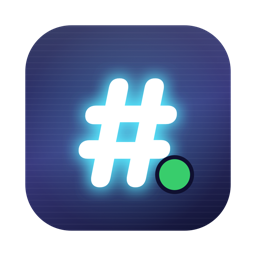
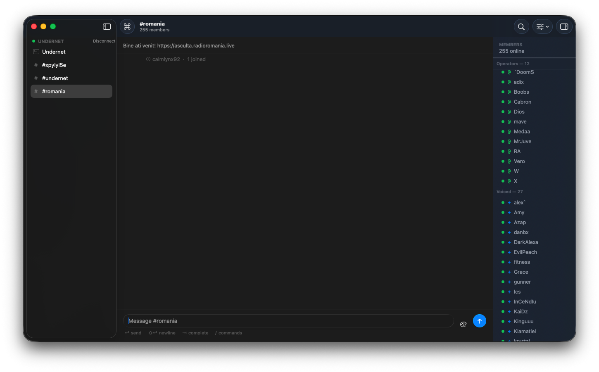
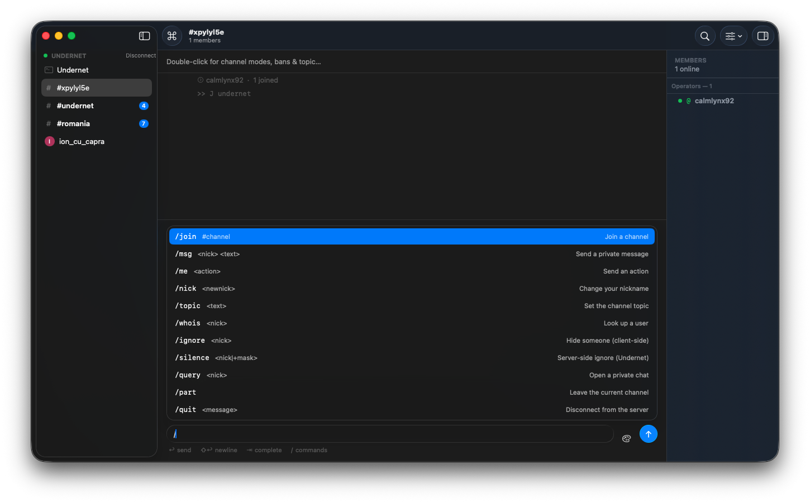
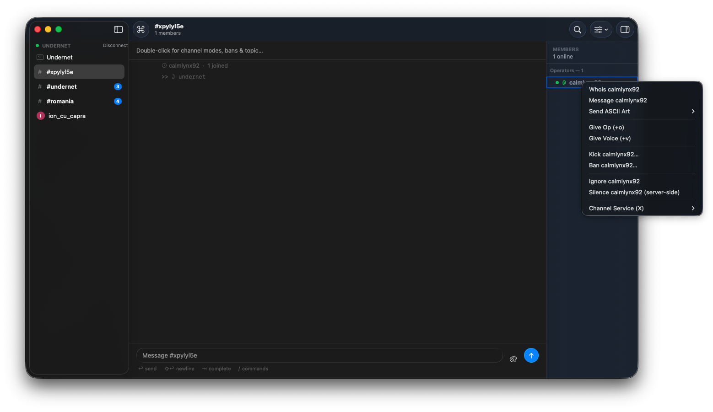
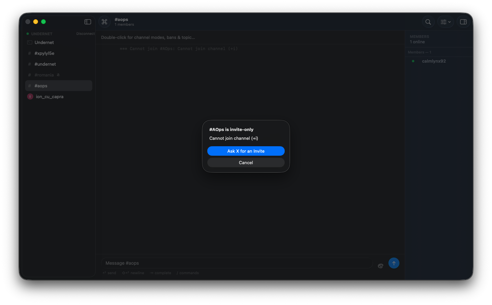
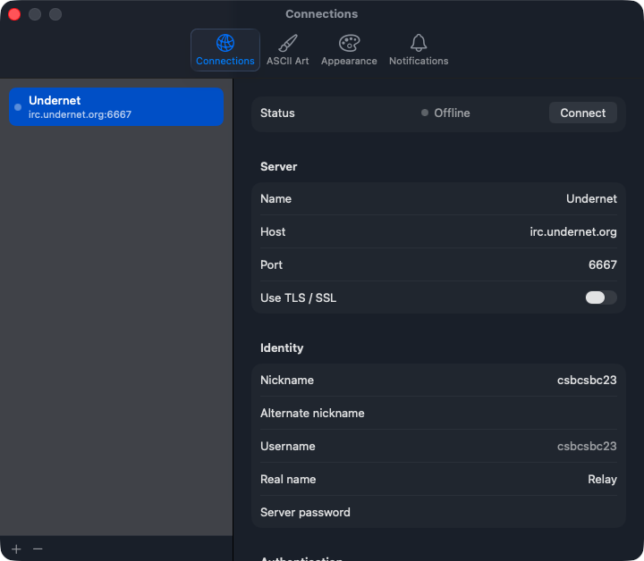
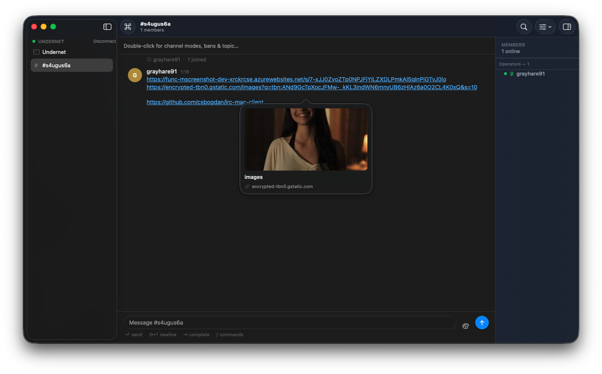
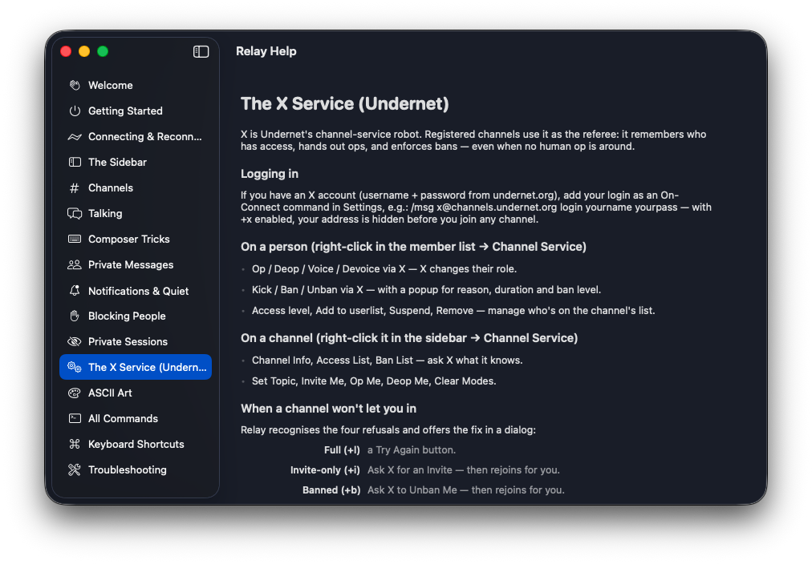

<div align="center">



# Relay

**A modern, native IRC client for macOS.**
Liquid Glass looks. mIRC soul.

[](https://github.com/csbogdan/irc-mac-client/releases/latest)


</div>



IRC is the internet's original group chat — running since 1988, still alive, still weird in the best way. Relay gives it a first-class Mac home: SwiftUI three-column layout, Liquid Glass on macOS 26, Notification Center, hover link previews — with all the culture intact: `/slap`, ASCII art, `+s` back rooms, and a channel-service bot named X.

## Features

**A real Mac app**
- Native three-column layout — networks & channels, conversation, member list
- Liquid Glass chrome on macOS 26 (graceful materials on 14/15)
- Mentions & DMs hit **Notification Center** when backgrounded — click to jump there
- Unread counts on the Dock icon, red/blue sidebar badges (mentions vs. activity)
- Hover any link for a live **preview card**; mIRC color codes render properly
- Fast: cached rendering, grouped messages, capped scrollback — floods don't lag it

**Classic IRC, done right**
- Multiple networks, TLS, SASL, server passwords, per-server identity
- **Auto-reconnect** with exponential backoff — runs your perform commands first, *then* rejoins your channels
- Tab completion that **cycles** through matches; ↑/↓ input history
- Built-in **flood protection** — paste 40 lines, keep your connection
- `/whois` with idle time & away, channel browser, ban lists, mode editors
- `/ignore` (client-side) and `/silence` (Undernet server-side) for pest control

**Undernet native**
- Full **X channel-service** integration: op/deop/voice, timed & levelled bans, userlists, suspend — all in right-click menus with proper parameter popups
- Join refused? Relay reads the reason and offers the fix: a key prompt on `+k`, one-click **"Ask X for an Invite"** on `+i`, **"Ask X to Unban Me"** on `+b` — then rejoins for you

**The fun parts**
- **Private Sessions**: one click reconnects you under a random nick into a random `+s` secret channel — no performs, no auto-joins, no trace
- An ASCII art catalog (rainbow greetings, table flips, trout) addressable to any nick — plus your own custom art with live preview
- A complete, human-readable **built-in manual** (⌘?)
- Quiet any channel: no counters, no notifications, just peace

## Screenshots

| Slash commands, discoverable | Everything on right-click |
|---|---|
|  |  |

| Join refused? One-click fix | Per-server everything |
|---|---|
|  |  |

<!-- pending shots
|  |  |
|  | |
-->

## Install

1. Grab `Relay-x.y.z.zip` from the [latest release](https://github.com/csbogdan/irc-mac-client/releases/latest)
2. Unzip and drag **Relay.app** to `/Applications`
3. First launch: **right-click → Open** (the app is self-signed, so macOS asks once)

Requires macOS 14 Sonoma or newer. Looks its best on macOS 26 Tahoe.

## Build from source

The Xcode project is generated from `project.yml` with [XcodeGen](https://github.com/yonaskolb/XcodeGen); the `.xcodeproj` is not committed.

```sh
brew install xcodegen
xcodegen generate
xcodebuild -project Relay.xcodeproj -scheme Relay -configuration Release build
swift test          # parser unit tests
```

<details>
<summary><b>Architecture</b> (for the curious)</summary>

```
Sources/
  App/RelayApp.swift             Scenes (main, Settings, About, Help) + menu bar
  Models/                        Network, Conversation, Message, ServerConfig, art catalog
  Networking/
    IRCParser.swift              RFC 1459/2812 + IRCv3 tags parser/serializer (pure, tested)
    LiveIRCClient.swift          NWConnection TLS transport actor; paced send queue
    IRCHub.swift                 Multiplexes one live client per network into one event stream
  Services/NotificationManager   Notification Center bridge
  ViewModels/AppModel.swift      @MainActor @Observable — all state, intents, reconnect logic
  Views/                         Sidebar, conversation, composer, member list, help, settings…
Tests/                           Parser unit tests
```

One seam: everything talks to the `IRCClient` protocol emitting an `IRCEvent` stream. The app is sandboxed with the outgoing-connections entitlement only.

</details>

## Versioning

[Semantic versioning](https://semver.org): breaking/major features bump minor, fixes bump patch. Every release ships a signed-ish zip of the app.

---

<div align="center">

Made by **Rufus** · 100% vibe-coded — the code has never been read, only felt

An homage to **mIRC**. Day ~11,000 of your 30-day evaluation period. Please consider registering.

🐟 *slaps you around a bit with a large trout*

</div>
